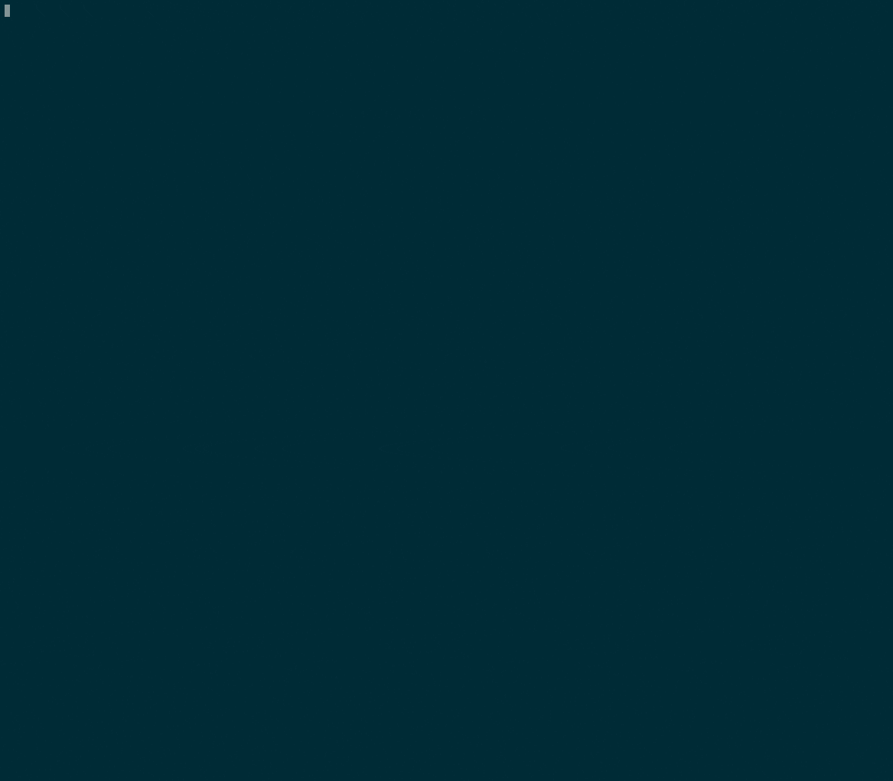

# Concorde

[Concorde](http://www.math.uwaterloo.ca/tsp/concorde/index.html) is likely the most famous solver for the [Travelling Salesman Problem](http://www.math.uwaterloo.ca/tsp/concorde/index.html).
It was developed by four legends in the Operational Research community: David Applegate, Robert Bixby, Vasek Chvatal, and William Cook.
The solver is blazing fast, and is able to solve enormous instances.

However, as most of its users know, building Concorde can be painful.
So painful that people have written
[technical reports](https://www.researchgate.net/publication/324485167_Concorde_solver_installation_and_use),
blog posts
[[1](https://www.leandro-coelho.com/install-and-run-concorde-with-cplex/),
[2](https://www.leandro-coelho.com/installing-concorde-tsp-with-cplex-linux/),
[3](https://hackaday.io/project/158802-improve-tool-path-planning-in-cura/log/147747-using-concorde-tsp-solver)],
stackoverflow questions
[[4](https://stackoverflow.com/questions/48284456/concorde-installation-need-to-link-an-lp-solver-to-use-this-function),
[5](https://stackoverflow.com/questions/29056498/cant-build-concorde-tsp-solver-on-mac-yosemite)],
(to link a few) dedicated to this topic.



# Build Concorde like it's not 1997 any more

## License

In this repository, I store a copy of the 2003 version of Concorde, together with a minimal build system.
Let me stress that this is a totally pirate version of the software.
In no way any of the authors have authorised me to fork their solver and create this repository.
Therefore, I have in no way any claim on authorship of this software.
If you are using Concorde from this repository you have to agree to exactly the same license as if you had downloaded it from the [official website](http://www.math.uwaterloo.ca/tsp/concorde/downloads/downloads.htm).
In short, this means that Concorde is free for you if and only if you use it for academic purposes.
In all other cases you should contact [William Cook](mailto:bico@uwaterloo.ca) to discuss licensing options.

For what concern my contribution, which is basically a `CMakeLists.txt` file, I release it to public domain under the [unlicense](https://unlicense.org/).

## Assumptions

My egomania has emerged when building this repository.
I assumed that everyone is exactly like me and, in particular:

* You are on Linux, with a recent version of GCC.
* You use CMake as your build system.
* You use a recent version of CPLEX as your LP solver.

Users not corresponding to this identikit might have to adapt this solution.

I also assume that you are interested in having the following, and nothing else, at the end of the build process:

* The executable (`concorde-bin`).
* A shared library (`libconcorde_full.so`), an archive file (`libconcorde_full.a`) and an include file (`concorde.h`) to use Concorde with your custom software.

## Building

Assume that you have Cplex installed in `/opt/ibm/CPLEX/my-cplex`.
Building Concorde, then, is as simple as:

```
mkdir build
cd build
cmake -DCMAKE_BUILD_TYPE=Release -DCPLEX_ROOT_DIR=/opt/ibm/CPLEX/my-cplex ..
make -j5
```

This will create the four files: `concorde-bin`, `libconcorde_full.so`, `libconcorde_full.a`, and `concorde.h`.
